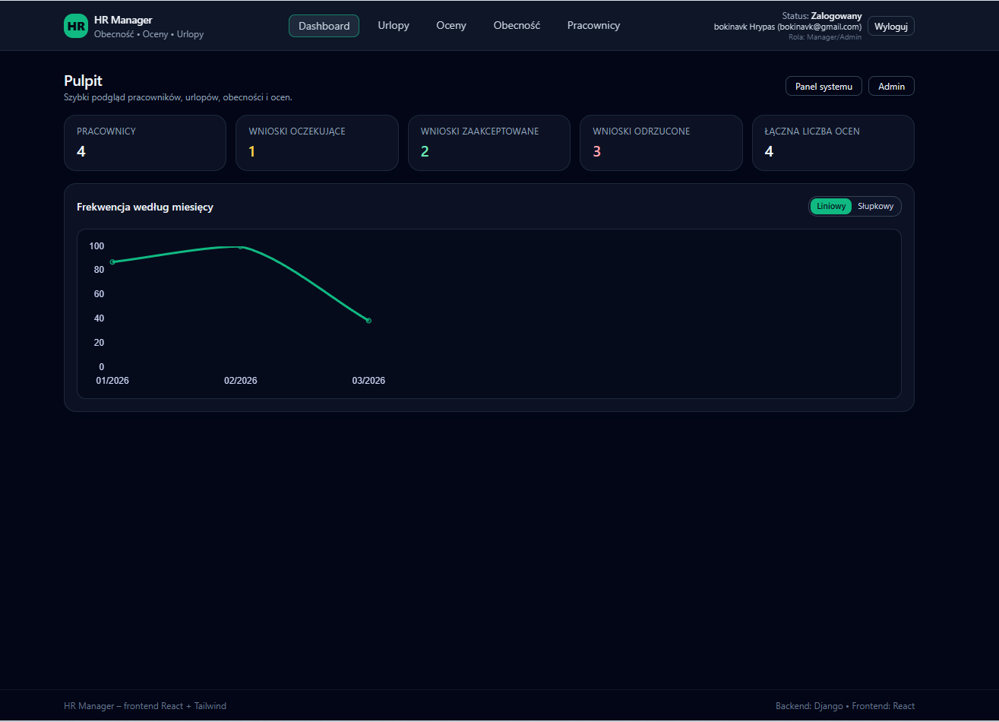
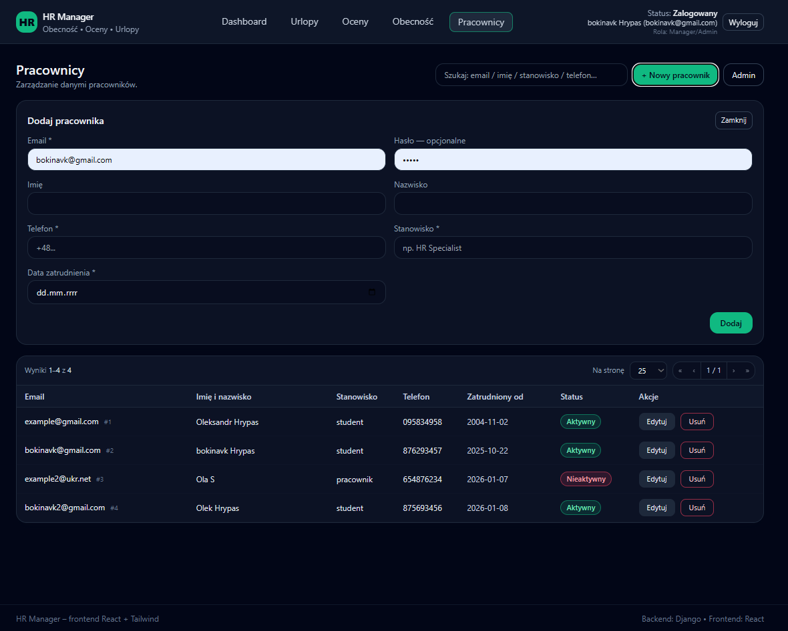
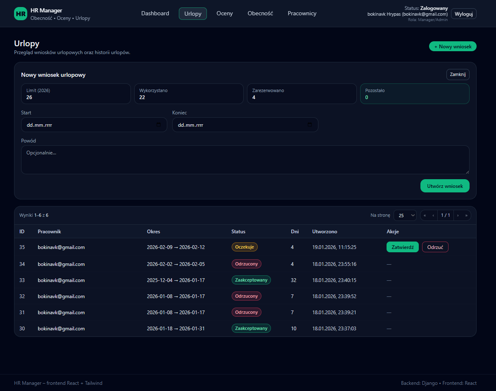
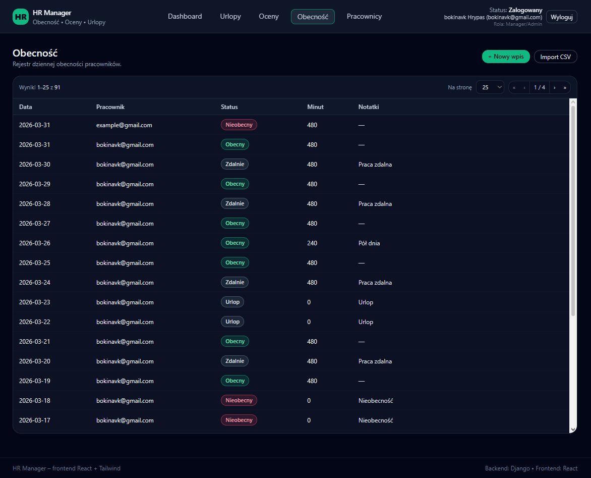

# HR Manager Web Application

[]()
[]()
[]()
[]()

A full-stack web application for managing employees, attendance, and leave requests in small organizations.

This project was developed as part of an engineering thesis.

---

## Screenshots







---

## Features

### Employee Management

* Create, update and delete employees
* Search and pagination
* Integration with Django admin panel

### Leave Management

* Create leave requests
* Approval and rejection workflow
* Validation rules:

  * working days only
  * conflict detection
  * yearly limits

### Attendance Tracking

* Daily attendance records
* Optional notes for each entry

### CSV Import

* Bulk attendance upload
* Row-level validation
* Error reporting without interrupting full import

### Reports and Analytics

* Monthly summaries
* Performance calculation

### Export

* CSV
* XLSX
* PDF

### Security

* Session and token authentication
* Role-based access control
* CSRF protection

---

## Tech Stack

### Backend

* Django
* Django REST Framework
* SQLite (development)

### Frontend

* React (Vite)
* Tailwind CSS

### Additional Tools

* Pandas (data processing)
* ReportLab (PDF generation)

---

## Architecture

```
React (SPA)
   ↓
REST API (Django REST Framework)
   ↓
Django ORM
   ↓
SQLite Database
```

---

## User Roles

### Employee

* Create leave requests
* View personal data

### Manager / Administrator

* Manage employees
* Approve or reject leave requests
* Manage attendance
* Import and export data

---

## Installation

### Backend

```bash
python -m venv .venv

# Activate environment
source .venv/bin/activate      # Linux / macOS
.venv\\Scripts\\activate       # Windows

pip install -r requirements.txt
python manage.py migrate
python manage.py createsuperuser
python manage.py runserver
```

### Frontend

```bash
cd frontend
npm install
npm run dev
```

---

## Usage

1. Open [http://localhost:8000](http://localhost:8000) or  [http://127.0.0.1:8000/](http://127.0.0.1:8000/)
2. Log in using your account
3. Navigate through the modules:

   * Employees
   * Leave Requests
   * Attendance
   * Reports

---

## API Overview

### Authentication

```
POST /accounts/login/
GET  /accounts/logout/
```

### Employees

```
GET    /api/employees/
POST   /api/employees/
PATCH  /api/employees/{id}/
DELETE /api/employees/{id}/
```

### Leave Requests

```
GET  /api/leave-requests/
POST /api/leave-requests/
POST /api/leave-requests/{id}/approve/
POST /api/leave-requests/{id}/reject/
```

### Attendance

```
GET  /api/attendance/
POST /api/attendance/
POST /api/attendance/import/
```

### Reports

```
GET /api/performance/
GET /api/performance/export/?file=csv|xlsx|pdf
```

---

## Project Structure

```
hr_manager/
│
├── core/
│   ├── models.py
│   ├── serializers.py
│   ├── views.py
│   ├── admin.py
│   ├── urls.py
│
├── hr_manager/
│   ├── settings.py
│   ├── urls.py
│
├── frontend/
│   └── src/
│       ├── pages/
│       ├── components/
│       ├── context/
│
├── requirements.txt
└── package.json
```

---

## Key Logic

### Leave Validation

* Ensures at least one working day
* Prevents overlapping requests
* Enforces yearly limits

### CSV Import

* Validates each row independently
* Supports create and update operations
* Returns detailed error information

### Reports

* Generated from attendance data
* Exported in multiple formats

---

## Security

* Session-based authentication
* CSRF protection
* Role-based access control
* Server-side validation

---

## Future Improvements

* Email notifications
* Public holidays integration
* Multi-step approval workflow
* Integration with external HR systems
* Docker support

---

## Full Documentation / Thesis
For a deep dive into the system architecture, database design, and business logic, 
you can read my full engineering thesis (in Polish): [HR_Manager_Thesis.pdf](./thesis/HR_Manager_Thesis.pdf)

---

## License

This project was created for educational purposes.

---

## Author

Oleksandr Hrypas
